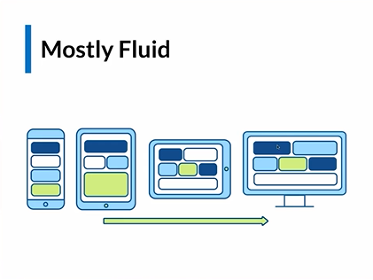

# Aprendizaje por CSS de basico a experto :D

Aprenderemos como centrar un div como hacer estilos movil first, expecificidad, position y display, flex y grid.
Ademas de las meda queris y las transition.
Un monto de cosas mas asi que vamo a darle xd....

## Modulo 1

**Aprendimos A usar la expecifidad y el modelo de caja en lo que se refiere al padding, margin, border y el elemento en si mismo. Ademas, implementamos clases CSS y conocimos estilos embebidos(no se como se escribe xd). Por ultimo hicimos usos de Pseudo clases y Pseudo elementos**

## Modulo 2

**Implementamos las medidas px rem em y min-width/heigth. Entendiendo que para min-wodth debemos partir de un tamano base mientras que para el heigth no, sino que le agregamos el min-heigth como medida para que todo el contenido quede dentro siempre. Ademas usamos vh y vw que son medidas relativas que lo que hace es hacer referencia al tamano de ancgo y largo de nuetra pantalla.**

## Modulo 3

**Centramos y manejamos todos los elementos con flexbox para reforzar lo conocimientos. Ademas de los display inline, block e inline-block. De la misma forma, incluimos el concepto de z-index que nos sirve para superponer elementos como dialogos o modale, recordando que el numero que le asignemos al z-index es indiferente pero debemos mantener un orden logicos**

> Contexto de apilamiento: debemos agregar un position: relative antex de usar z-index. Este va aplicado al elemento que queramos cambiarle el z-index.

# Responsive design and mobile first 

Todos nuestros proyectos deben de empezar con un design primeramente mobile y luego ir escalando a desktop. Esto quiere decir que mientras desarrollamos nuestro proyecto tenemos que ir disesandolo como si fuera una app de tlf primeramente y despues ir viendo como se veria en un ordenador.

# TODOS LOS MEDIA QUERY DEBEN IR ABAJO 

>La media query No es la mejor práctica 
---------- --------
@media (min-width: 480px){
 ...
}
@media (min-width: 768px){
 ...
}@media (min-width: 1024px){
 ...
}
-------- ----------

**Tambien podemos inyectar un archivo .css distinto desde nuestro html para no tener que cargar todos los disenos en un solo archivo y asi hacer mas optimo nuestro proyecto**

Este podria ser nuestro estilo mobile first:

`<link rel="stylesheet" href="./style.css"> `

Y este el diseno para pantallas de tablets:

`<link rel="stylesheet" href="tablet.css" media="screen and (min-width:768px)">`

Y este para pantallas mas grandes tipo ordenadores:
`<link rel:'stylesheet' href:'./desktop.css' media:'screen and (min-width: 1024px)' />`

## Patron mustly fluid:

# Imagenes responsive !!

## Etiqueta picture

Funciona igual que nuestra etiqueta de video, basicamente tiene tres sources que renderizan a tres imagenes dependiendo de la media query que le pasemos. La primera siempre debe ser la mas grande (800px - 1024px) y la segunda la mediana (600px - 800px), estas dos deben ir dentro de una etiqueta "source" cada una y con el atributo media, que es el que definira sus dimensiones a renderizar y srcset que es donde ira el link de las mismas. Por ultimo renderizamos la de por defecto que seria la img mas pequena teniendo en cuenta que trabajamos bajo la modalidad mobile first/

`<picture>
  <source media="(min-width:800px)"  srcset="./images/large.png">
  <source media="(min-width:600px)"  srcset="./images/media.png">
  
 </picture>`

 Con esto basicamente le decimos al navegador que renderice una img dependiendo de la screen q se este utilizando en el momento. Y asi nuestra pagina no tiene que estar cargando una img demasiado pesada cuando no sea necesaria. Recordar siempre que el orden es de mayor -> medio -> menor. 

 -------------

 **Nota: por temas de accesibilidad es mejor usar medidas REM para los txt TODOS H1 H2 H3 H4 H5 H6 P STRONG SPAN DIV A LI Todos los que sean txt deben de ser medidos en rem y no en pixeles ya que si el usuario quiee agrandar el tamano de font default en el navegador y nuestros txt estan medidos en px estos no se modificaran pero si estan en rem si lo haran pq son  medidas relativas**

 -------------
 